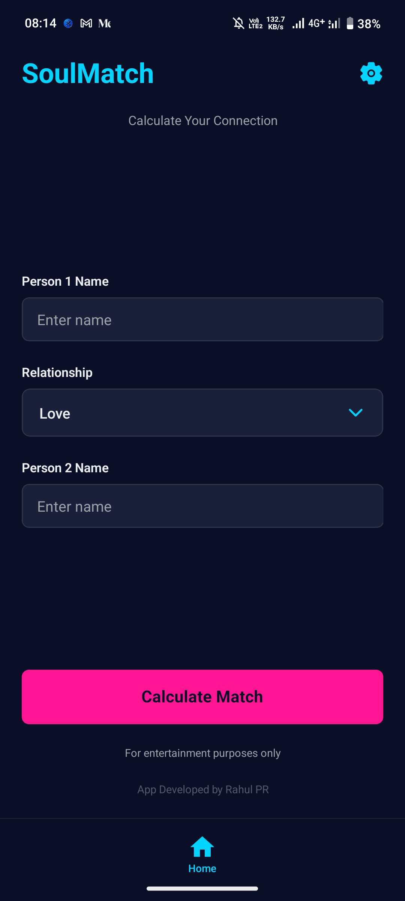
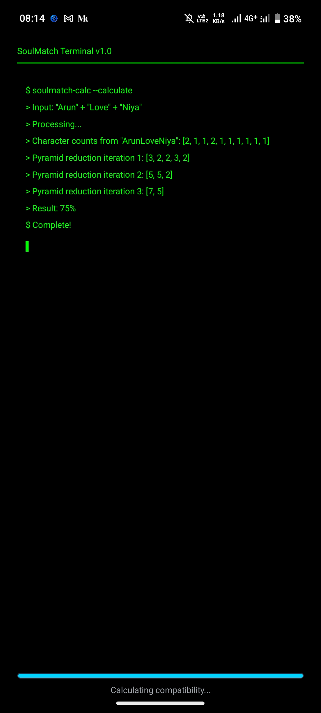
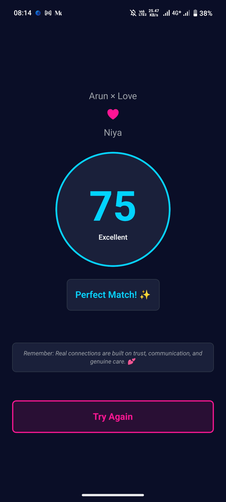
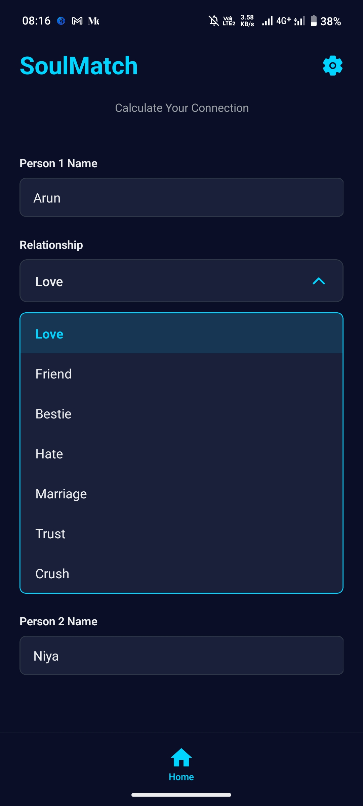
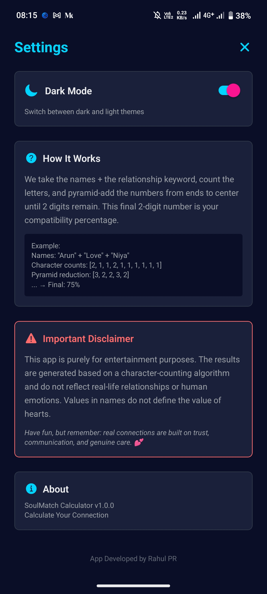
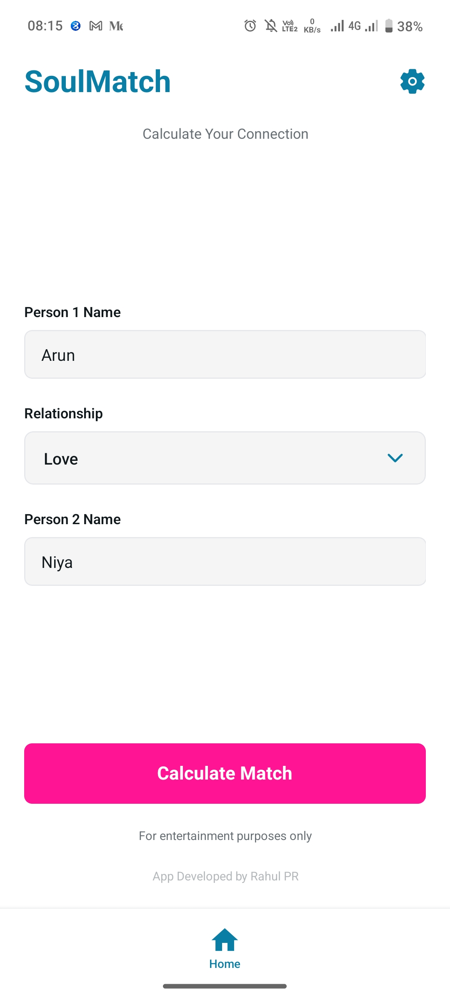

# 💘 SoulMatch: Love Compatibility Calculator


*(Note: You can replace this link with your own banner image later)*

**SoulMatch** is a fun and interactive mobile application built with **React Native & Expo** that calculates relationship compatibility using a classic pyramid reduction algorithm. It allows users to test the chemistry between two names and get a compatibility percentage!

---

## 📱 Screenshots

Check out the **Light Mode** vs **Dark Mode** design:

### 🏠 Dark Mode 🌙
      


### Light Mode ☀️


---

## ✨ Features

- **🚀 Instant Calculation:** Uses an optimized algorithm to calculate compatibility in milliseconds.
- **🎨 Clean UI:** Simple, user-friendly, and attractive interface.
- **📱 Cross-Platform:** Works smoothly on Android devices.
- **🔒 Privacy Focused:** No personal data is stored or shared.

---

## 🛠️ Tech Stack

- **Framework:** [React Native](https://reactnative.dev/)
- **Tooling:** [Expo](https://expo.dev/)
- **Language:** TypeScript / JavaScript
- **Platform:** Android

---

## 📥 Installation & Usage

To run this project locally:

1. **Clone the repository**
   ```bash
   git clone [https://github.com/rahulpravi/soulmatch-calculator.git](https://github.com/rahulpravi/soulmatch-calculator.git)
   cd soulmatch-calculator
## 📥 Download App

Click below to download the Android APK directly:

<a href="https://drive.google.com/file/d/1F0kPYudFSnOkGKcCJLHPC3waWx7SAMAx/view?usp=drivesdk">
  
</a>

---

## 🌐 Connect with Me

[](https://www.facebook.com/share/18PKwaQNjX/)
[](https://www.linkedin.com/in/rahul-pr-334561226)
[](mailto:rahulpravi1999@gmail.com)

---
